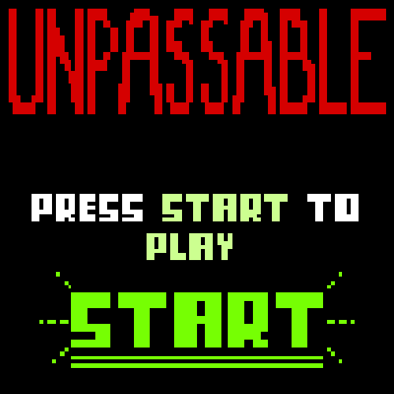
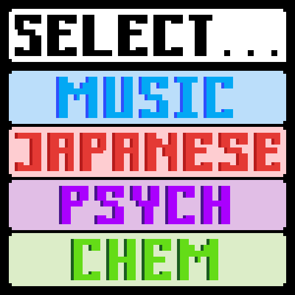

<h1 align="center">Welcome to Unpassable</h1>

 
## Game Description

`Unpassable` is a game based off of Jeopardy. To play the game, one must select 'start', then a choose a subject to be quizzed on. As you answer the questions by clicking on the letter that corresponds to what you think is the right answer, your score is being kept. If your score is high enough, you will pass. Otherwise, you will fail.

 
 

 
## Usage

  Mouse: use to click on answers

# Classes
### ***Chemistry***
This class presents the chemistry questions and answer choices if the subject "Chemistry" is selected. When an answer is chosen, it checks the answer with the answer key, using an index to confirm the answer.

 
 
### ***Psychology***
This class presents the psychology questions and answer choices if the subject "Psychology" is selected. When an answer is chosen, it checks the answer with the answer key, using an index to confirm the answer.

 

### ***Japanese***
This class presents the japanese questions and answer choices if the subject "Japanese" is selected. When an answer is chosen, it checks the answer with the answer key, using an index to confirm the answer.

 
 
### ***Music History***
This class presents the music history questions and answer choices if the subject "Music History" is selected. When an answer is chosen, it checks the answer with the answer key, using an index to confirm the answer.
 
 
 
# Methods
### ***Paint***
This method draws the background, platform, and characters onto the screen. It also updates the position of the character and platforms throughout the game. An image of the moving platform is included because it requires position updates. Information on the updates will be continued in collisions.
 

### ***Collisions***
Collisions occur when the character land on a platform. There are two collisions as one collisions is for colliding with a normal platform and there is one method for the collision of the red block.
 

### ***Game Over***
When the character is unable to land on a platform or lands on a red platform, the character position and score are reset. This is done by setting the character to its inital position, turning gravity off and setting velocity to 0.
 

### ***Creating Objects***
Objects are created individually or in arrays using loops.
 

# Support
Contact Vianne, Swasti, or Maya for support
 
# Roadmap
 Though an update is not likely, if it were to happen, *suggestions to what we could do*

 
# Contributing
 Anyone may contribute.
 
# Authors and Acknowledgements
The game is inspired by Jeopardy. All images and code were made by us. Thank you Mr. David for helping us with XXXXXXXX.
